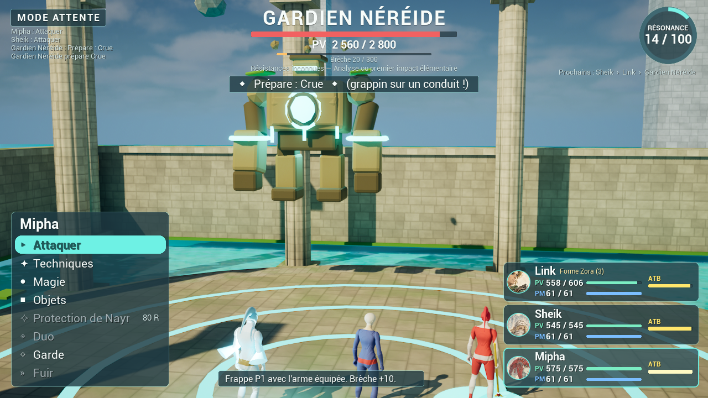

# Zelda — Les Échos de la Triforce (prototype Unreal Engine 5.8)

RPG à commandes façon Final Fantasy VIII / IX (ATB en **mode Attente**) construit à partir du dossier de conception
*Les Échos de la Triforce* (89 pages + catalogue JSON de 1 257 références). Projet de fan non officiel : *The Legend of Zelda*
et ses personnages appartiennent à Nintendo. Ne pas diffuser publiquement sans décision de droits (chapitre 21 du dossier).



## Lancer le jeu

1. Ouvrir `EchosTriforce.uproject` avec **Unreal Engine 5.8** (le module C++ est déjà compilé ; sinon accepter la recompilation).
2. Appuyer sur **Play** (carte `L_Cistern`). En autonome :
   ```bash
   "/Users/Shared/Epic Games/UE_5.8/Engine/Binaries/Mac/UnrealEditor" "$PWD/EchosTriforce.uproject" -game -windowed -ResX=1920 -ResY=1080
   ```
3. Écran titre : *Nouvelle partie* (la Citerne des mémoires), *Continuer*, trois **combats rapides** (Néréide, Sentinelle, Chuchus),
   et le **Mode Archiviste** (les 1 258 objets et toutes les formes débloqués, Résonance à 60) pour tout tester tout de suite.

La première exécution compile les shaders (quelques minutes, 1-2 images/s au début).

## Contrôles

| Contexte | Clavier / souris | Manette |
|---|---|---|
| Exploration | ZQSD ou WASD / flèches, souris = caméra, **E** interagir, **Espace** sauter (ou parler/interagir s'il y a quelque chose devant Link), **F** ou clic = frapper (attaque préventive : jauges +200), **Tab** menu | stick gauche/droit, A, X, Start |
| Combat | ↑↓ choisir, Entrée/Espace valider, Échap/clic droit retour, ←→ changer de cible, **Tab** vitesse des jauges 1×/1,5×/2× | croix, A, B, RB |
| Menu | ↑↓, Entrée, Échap, **Q/E** ou PgPréc/PgSuiv = onglets, 1-7 onglet direct, **T** = filtre de type (Collection) | croix, A, B, LB/RB |

## Ce qui est implémenté (renvois au dossier)

| Dossier | Dans le jeu |
|---|---|
| Ch. 4 — ATB mode Attente | Jauges `J += (100 + 3×AGI) × vitesse × dt`, file prête ordonnée, pause pendant les menus et les animations, Garde, Fuite, Objets, reciblage déterministe. |
| Ch. 5 — Dégâts | Formules exactes (ATQ, AMAG, DEF, DFM, P, E, C, G, V), plafonds, critique, précision, bonus plafonnés à +50 %. **La trace numérique du ch. 17 est reproduite par les tests (127 / 89 / 87 / 43 / 21 / 259).** |
| Ch. 6 — Éléments, altérations, Brèche | 8 éléments + neutre, Mouillé/foudre ×1,5, Gel, Brûlure, Choc, Poison, Sommeil, Silence, Cécité, Provocation, Fragilité, Enlisement, Stabilité ; jauge de Brèche 100/200/300. |
| Ch. 7 — Niveaux | Courbe de Link N1→N99, XP `50 + 25L + 10L²`, gains à tous les recrutés, PV/PM augmentés de l'écart sans soin complet. |
| Ch. 8-9 — Apprentissage | 6 techniques préparées, PA par pièce portée (3/8/20), maîtrise définitive, capacité de passifs, **110 techniques** (lame, garde, tir, reliques, chants, âmes, kits des compagnons, formes). |
| Ch. 10-11 — Équipement | 10 emplacements, deux mains ↔ bouclier, **tenue monobloc sur 3 emplacements**, bonus d'ensemble, anneaux de même famille non cumulables, comparaison avant/après, fiches distinctives (Master Sword, Biggoron, bouclier hylien, Armure Zora de TP à -20 % feu/glace…). **Tunique Zora = Eau -50 %.** |
| Ch. 12 — Compagnons | Link, Sheik, Mipha jouables ; Impa, Midna, Daruk, Revali, Urbosa définis (multiplicateurs + kits). |
| Ch. 13 — Résonance, duos, invocations | Résonance 0-100 (+6/+4/+2, max +12 par activation), **8 esprits** (Grande Fée, Valoo, Jabun, Quatre Géants, Poisson-Rêve, Esprit de la forêt, Nayru, Farore), **4 duos**. |
| Ch. 14 — Formes | **Masques Mojo, Goron, Zora, Dieu démon (Oni), Géant, Loup, Résonance de Majora** : 3 activations, multiplicateurs, 3 commandes, faiblesses, contrecoups. Art conceptuel affiché à la transformation. |
| Ch. 16-17 — Prototype | **Citerne des mémoires** : 10 salles explorables (coffres, atelier et tunique Zora, vanne au grappin, Mipha qui rejoint, énigme des 3 symboles, fontaine + masque Zora, sauvegarde, sceau), ennemis visibles, **Gardien Néréide** en 3 phases (Crue sabotable au grappin, Surcharge électrique, Déluge annulé par 2 vannes). |
| Ch. 18 — Collection | **1 258 objets des 21 jeux** consultables par jeu et par type, possédés ou verrouillés avec leur voie de déblocage, source et note de canon. |
| Ch. 20-21 — Objets, sauvegarde, interface | Potions, fées, remèdes, lait ; sauvegarde avec copie de secours ; options vitesse ATB/animations, difficulté Histoire/Standard/Héroïque, taille du texte. |
| Ch. 23 — Cas limites | Tests d'acceptation automatiques (voir ci-dessous). |

## Structure

```
Source/EchosTriforce/
  Core/   ZTypes (données), ZGameData (lecture des JSON), ZProgression (niveaux, équipement), ZCombat (simulation pure)
  Game/   ZGameInstance (équipe, inventaire, sauvegarde), ZBattleDirector + ZBattlePawn (présentation du combat),
          ZCistern (niveau, interactions, ennemis visibles), ZExploreCharacter, ZVisuals, ZEnvironment, ZPlayerController
  UI/     ZBattleHUD, ZMenuWidget, ZExploreHUD (+ écran titre), ZUI (boîte à outils UMG en C++)
  Tests/  ZCombatTests (7 tests)
Content/Data/   items, abilities, forms, spirits, duos, characters, enemies, encounters, consumables, passives, quests, sources (.json)
Content/Art/    textures, matériaux (pierre triplanaire, eau, cascades, peau peinte), modèles Blender
Tools/          scripts de données, d'art, de tests et de captures
Docs/           catalogue d'origine, texte du dossier, concept arts, captures
```

La simulation (`FZCombatSim`) ne dépend d'aucun rendu : la présentation lit ses événements, conformément au chapitre 22.

## Modifier le contenu

- **Données** : éditer `Tools/build_game_data.py` (techniques, formes, esprits, ennemis, fiches distinctives) puis
  `python3 Tools/build_game_data.py`. Le catalogue d'origine est `Docs/catalogue_zelda_rpg.json`.
- **Art** :
  ```bash
  python3 Tools/art/make_textures.py
  /Applications/Blender.app/Contents/MacOS/Blender -b -P Tools/blender/make_models.py -- "$PWD/Tools/art/fbx" [sword_hero …]
  ```
  (les noms après le dossier limitent la génération à ces modèles ; `ECHOS_ONLY=SM_Sword_Hero` limite de même
  `import_models.py`) puis dans Unreal (ou en ligne de commande avec `-run=pythonscript -script=…`) : `Tools/ue/create_assets.py`,
  `Tools/ue/import_models.py`, `Tools/ue/create_map.py`. Un maillage placé dans `/Game/Art/Meshes` remplace automatiquement la
  forme de repli correspondante (voir `ZVisuals.cpp`).
- **Personnage à partir d'un modèle 3D + planches** (méthode actuelle de Link) : modèle en pose T sans squelette (FBX avec
  sa texture et ses normales, ex. généré « image → 3D ») + planches de face et de dos :
  ```bash
  /Applications/Blender.app/Contents/MacOS/Blender -b -P Tools/blender/rig_model.py -- Tools/art/source/link_model.fbx \
      Tools/art/export/SKM_Manny_Simple.fbx Tools/art/source/link_front.jpg Tools/art/source/link_back.jpg Tools/art/out/link link
  ```
  puis `import_character.py` (ci-dessous), qui détecte `T_Link_Albedo.png` et crée `M_ZToonModel` : dessins nets de face et
  de dos, texture et relief du modèle sur les flancs, teinte de tunique selon la tenue. Le script cale le modèle sur la planche,
  l'allège (90 000 triangles), ramène les bras aux proportions du squelette, transfère les poids du mannequin, nettoie la
  texture générée (ombres cuites, taches sombres), **recale les planches sur le modèle** (flot optique robuste entre chaque
  planche et une vue de la texture du modèle au même cadrage : visage, sangles, ceinture et bouclier se superposent, plus
  d'images doublées dans les fondus), projette les planches (test de visibilité, rejet des zones où dessin et modèle ne
  concordent pas), harmonise la palette de la texture du modèle sur celle des planches (table de couleurs apprise là où les
  deux se superposent) et sépare la poignée d'épée (masquée quand l'épée est en main). Outils d'image sans OpenCV :
  `Tools/blender/tex_tools.py` (tramage, flot optique, flous). Les animations d'arme prennent `SKM_Link` comme maillage de référence (sinon l'UE éloigne
  l'épée du poing, voir `import_character.py`).
- **Link actuel (« hybride », skill blender-image-to-3d)** : pièces modélisées en code et recalées sur les planches, modèle IA
  comme source de cuisson, dossier `Tools/art/CH_Link` (`asset-brief.md`, notes de contrôle dans `review/`). Phases dans l'ordre :
  ```bash
  cd Tools/art/CH_Link; B=/Applications/Blender.app/Contents/MacOS/Blender
  for p in 01_high 02a_skeleton 02_blockout 03_forms 04_topology; do $B -b -P build/$p.py -- --master CH_Link_master.blend; done
  $B -b -P build/05_materials.py -- --master CH_Link_master.blend --device CPU   # le bake Metal plante sur ce Mac
  $B -b -P build/06_rig.py -- --master CH_Link_master.blend
  $B -b -P build/09_export.py -- --master CH_Link_master.blend --name SKM_LinkHybrid
  cd ../../..; "/Users/Shared/Epic Games/UE_5.8/Engine/Binaries/Mac/UnrealEditor" "$PWD/EchosTriforce.uproject" \
      -ExecutePythonScript="$PWD/Tools/ue/import_link_hybrid.py" -unattended -nosplash
  ```
  Le jeu utilise `SKM_LinkHybrid` ; `-ZOldLink` réaffiche l'ancien `SKM_Link` (conservé : les animations d'arme s'y réfèrent).
- **Personnage texturé à partir de planches seules** (face + dos, même cadrage ; première version de Link) :
  ```bash
  /Applications/Blender.app/Contents/MacOS/Blender -b -P Tools/blender/make_character.py -- \
      Tools/art/export/SKM_Manny_Simple.fbx face.jpg dos.jpg Tools/art/out/link link
  "/Users/Shared/Epic Games/UE_5.8/Engine/Binaries/Mac/UnrealEditor" "$PWD/EchosTriforce.uproject" \
      -ExecutePythonScript="$PWD/Tools/ue/import_character.py" -unattended -nosplash
  ```
  Le script découpe les accessoires dessinés (bouclier, fourreau, poignée, oreilles, objets à la ceinture) et les extrude en
  volumes, efface ce qui est modélisé à part dans la texture du corps, recale torse et jupe sur la silhouette, gonfle la
  calotte du mannequin jusqu'à la silhouette dessinée des cheveux et du bonnet, puis projette les planches : face et dos sont
  fondus sur les flancs (4 canaux UV, matériau `M_ZToonTex`), les côtés de la tête sont peints (blond et vert prélevés sur les
  planches). Les coordonnées des accessoires et le calibrage (785 px/m, pieds à y = 1471, axe x = 1010) sont en tête du script.
- **Animations d'arme** (garde, taille, estoc, attaque tournoyante, incantation, parade, victoire) :
  `Blender -b -P Tools/blender/make_anims.py -- Tools/art/export/SKM_Manny_Simple.fbx Tools/art/anims [aperçu]`, importées par
  `import_character.py`. L'épée de Link suit l'os `weapon_r`.
- **Habillage du temple** (herbe, lierre, bannières, arcatures, ruines, nénuphars, fontaine, cristal, vanne, stèle, piédestal,
  sceau) : `Blender -b -P Tools/blender/make_env_kit.py -- Tools/art/fbx`, texture de bannière `python3 Tools/art/make_banner.py
  Tools/art/out/T_Banner_Water.png`, puis `create_assets.py` et `import_models.py`.
- **Personnages de Twilight Princess (depuis l'ISO GameCube de l'utilisateur, usage privé)** : `Tools/tp/tplib` lit le disque
  (FST), le Yaz0, les archives RARC, les textures GX, les modèles J3D (BMD/BDL) et les animations BCK (formats vérifiés sur le
  code décompilé zeldaret/tp). `Tools/tp/presets.py` décrit ce qu'on extrait (Link : corps + visage + cheveux, épées, fourreau,
  boucliers en main et rangés, 433 animations + combinaisons bas/haut du corps). Chemin de l'ISO : variable `TP_ISO`.
  ```bash
  /Applications/Blender.app/Contents/MacOS/Blender -b -P Tools/tp/blender_tp.py -- --preset link --out Tools/art/tp/link --anims all --preview rest
  TP_PRESET=link "/Users/Shared/Epic Games/UE_5.8/Engine/Binaries/Mac/UnrealEditor" "$PWD/EchosTriforce.uproject" \
      -ExecutePythonScript="$PWD/Tools/ue/import_tp.py" -unattended -nosplash
  ```
  (`--anims waits,cutr` ou `TP_ANIMS=waits,cutr` pour n'en traiter que quelques-unes ; l'éditeur plante en quittant après
  avoir tout sauvegardé.)
  **Décors** (salles `res/Stage/<zone>/Rxx_00.arc`, en coordonnées monde, collision « complexe comme simple ») :
  ```bash
  /Applications/Blender.app/Contents/MacOS/Blender -b -P Tools/tp/blender_tp.py -- --stage D_MN01 --name TPLakebed --out Tools/art/tp/lakebed --start-room 1
  TP_PRESET=lakebed "/Users/Shared/Epic Games/UE_5.8/Engine/Binaries/Mac/UnrealEditor" "$PWD/EchosTriforce.uproject" \
      -ExecutePythonScript="$PWD/Tools/ue/import_tp.py" -unattended -nosplash
  ```
  crée `/Game/Maps/L_TPLakebed` (Temple de Lanayru, 13 salles). Matériau `M_TPEnv` : calcul du TEV d'origine
  (texture × couleur de sommet × `Gain`, en espace gamma), surtout émissif. Une carte dont les acteurs portent le tag
  `ZTPStage` n'a pas de Citerne : l'équipe part du PlayerStart (`-ZTPStart=x,y,z,lacet` pour les captures).
  Zones utiles : `D_MN01` Lanayru, `D_MN05` Forêt, `D_MN04` Mines Goron, `D_MN10` Arbitre, `D_MN11` Pic des neiges,
  `D_MN06` Temple du Temps, `D_MN07` Cité céleste, `F_SP103` Toal, `F_SP108` Bois de Firone, `F_SP121` Plaine d'Hyrule. Le jeu utilise `/Game/Art/TP/TPLink/SKM_TPLink` pour Link dès qu'il existe (`-ZNoTP` : l'ancien) ;
  `UZTPAnimInstance` (`Game/ZTPAnim.cpp`) joue ses animations d'origine avec fondus, `ZVis::AnimIn` associe les rôles du jeu
  aux animations de TP (`Tools/tp/link_anims.json` : table `m_anmDataTable` de d_a_alink.cpp).
- **Compilation** : `Tools/build.sh` · **Tests** : `Tools/run_tests.sh`
- **Captures automatiques** : `Tools/shot.sh <nereide|sentinel|chuchu|explore|menu1|booth> "8,16" 18 nom [-ZAutoPlay] [-ZArchivist] [-ZKeys=Enter,Down]`
  — options utiles : `-ZRoom=R05 -ZYaw=90` (salle de départ), `-ZWalk=6 -ZJumpAt=3` (Link avance / saute tout seul),
  `-ZTitleCam=x,y,z -ZTitleLook=x,y,z` (vue de l'écran titre), `-ZBoothAnim=Victory`, `-ZBoothClose`, `-ZCamBase=x,y,z -ZCamLook=x,y,z
  -ZCamFov=62` (caméra de combat), `-ZWeaponRot=p,y,r`, `-ZNoArt` (mannequin peint), `-ZNoSerif` (police du moteur).

## MCP Unreal (Claude Code)

Le plugin `unreal-engine-skills-for-claude-code` est installé, les plugins `ModelContextProtocol` et `AllToolsets` sont activés,
le serveur démarre automatiquement avec l'éditeur (port 8000, vérifié) et `.mcp.json` est à la racine. Ouvrir l'éditeur, puis
redémarrer la session Claude Code dans ce dossier pour que les outils `unreal-mcp` apparaissent.

## Limites connues et suite

- **Link** est le modèle 3D fourni, riggé sur le squelette du mannequin et texturé avec les planches ; **Sheik, Mipha et les formes** sont encore des mannequins
  « peints ». Une planche face + dos en pose T par personnage suffit pour appliquer la même chaîne.
- Sur les flancs, Link garde la texture générée du modèle, un peu moins nette que les dessins de face et de dos.
- Pas encore d'effets Niagara, de son ni de musique ; les invocations sont une sphère lumineuse et une bannière.
- Police : Iowan Old Style et Copperplate du système macOS, chargées sur place (non copiées). Pour une version distribuable,
  déposer des polices libres dans `Content/UI/Fonts` (`Regular.ttf`, `Bold.ttf`, `Title.ttf`, ex. Cinzel en OFL) : elles
  sont prioritaires.
- Contenu : seul le chapitre 2 (Citerne) est jouable ; forge, Amalgame, boutiques, contrats, cycle de Termina, quêtes de lien,
  invités et les 9 autres donjons restent à produire (plan des lots du chapitre 24).
- Environ 90 effets d'objets sur 1 258 sont descriptifs (non encore traduits en règles) : ils s'affichent comme tels dans la Collection.
